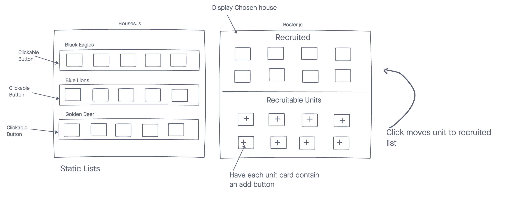

Fire Emblem: Three Houses Roster Builder
===============

A single page application that allows users to create their own unit roster for Fire Emblem: Three Houses.

Technologies Used
===============
 - HTML5
 - CSS3
 - Javascript
 - Express
 - MongoDB
 - Mongoose
 - React

Screenshots
===============

Getting Started
===============
Heroku Deployment Pending

Future Enhancements
===============
- Implement basic authorization
- Include buttons
- Display unit details on recruit page